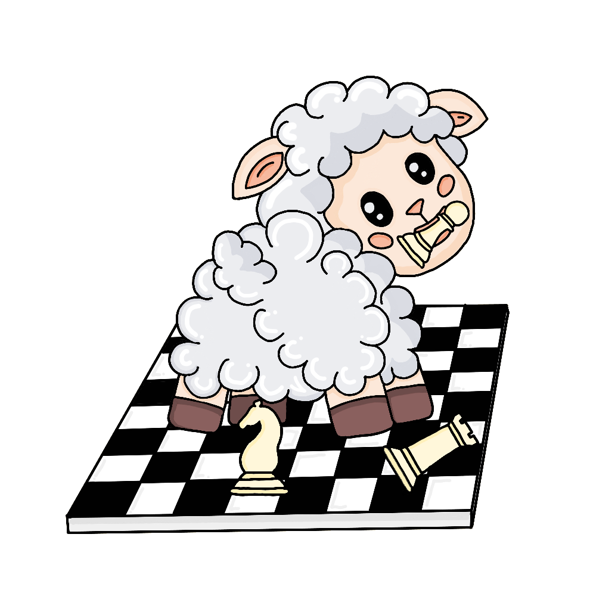

# ♟️ SHEEP ENGINE ♟️
<p align="center">
  
</p>

# Overview

A simple chess engine, with UCI and Web Gui

## Movegeneration and board representation
I am using a  in order to generate moves, and keep current board position.

## Search
To search for best move, I implemented:
- 
- 
- 

Move ordering is based on best move from previous iterration, 
, 


## Evaluation
Sheep engine uses , 
including piece values, piece-square tables, passed or dobuled pawn

## How to use it
To use sheep engine u can download binary version, or build from source

### Source
Just download the source code, and run
```
cargo build --release
```

Binary file should be found in target/release/chess_engine

### Using it
After start engine will wait until u type one of the options gui or uci.

```GUI: Start web server at localhost:8080, where u can play by just moving piece```

```UCI: Engine will start in uci mode, and will be ready to play.```

I implemented basic UCI commands, it's working pretty well with arena chess gui

### TODO LIST
- Implement transposisiton tables
- Implement openining and ending tables
- Check engine strength (ELO)
- Refactorize code